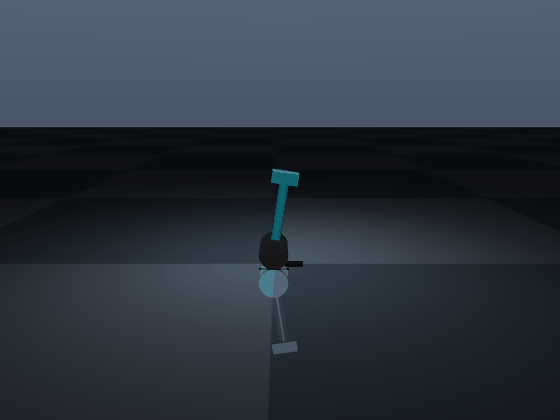
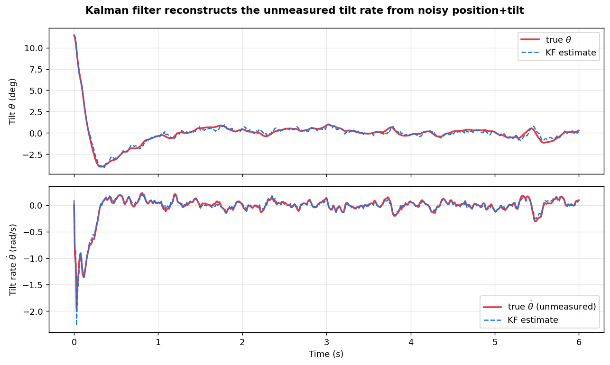
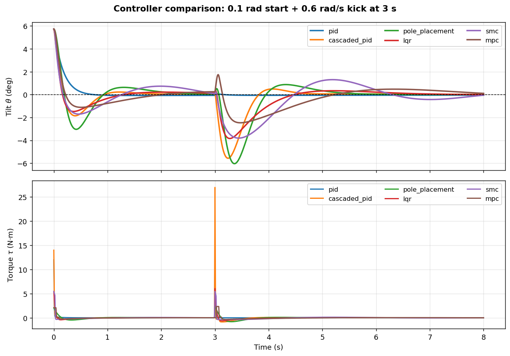

<div align="center">

# 🛴 Segway Control Suite

**A rigorous, reproducible benchmark of control strategies for a self-balancing wheeled inverted pendulum — from classical to learned.**


[](https://manas-arumalla.github.io/segway-control-suite/)




<sub><b>Left:</b> LQR recovering from a tilt + disturbance kick. &nbsp; <b>Right:</b> energy-based swing-up — the robot stands itself up from hanging, then balances.</sub>

</div>

> An engineering-grade reimagining of an earlier prototype (kept untouched under
> [`Control GUI/`](Control%20GUI/) for reference). **Feature-complete — 50 tests passing,
> lint-clean.**

---

## Contents

- [Overview](#overview) · [Highlights](#highlights) · [Controllers](#controllers)
- [Demos](#demos) · [Realistic sensing](#realistic-sensing--state-estimation) · [Benchmark](#benchmark-results) · [Auto-tuning](#auto-tuning)
- [The model](#the-model-honest-description) · [Quickstart](#quickstart) · [Apps](#interactive-apps)
- [Layout](#repository-layout) · [Docs](#documentation) · [Contributing](#contributing) · [Citation](#citation) · [License](#license)

## Overview

A self-balancing robot (a **wheeled inverted pendulum**, like a Segway) is the *Drosophila*
of control theory: simple to state, unstable, nonlinear, and underactuated — the perfect
testbed to compare how different controllers actually behave.

This project implements **one validated plant model** and runs a battery of controllers
against it under **identical, reproducible scenarios**, producing quantitative head-to-head
metrics, stability analysis, and publication-quality visuals.

## Highlights

- **One validated plant** — the analytic linearization is cross-checked against a
  finite-difference Jacobian *and* an independent symbolic derivation.
- **Ten control strategies + a trajectory optimizer**, from PID to a learned PPO policy.
- **Realistic sensing** — noisy encoder + IMU with a Kalman/EKF reconstructing the
  unmeasured velocities.
- **A real benchmark** — region of attraction, Monte-Carlo robustness, and an automated
  multi-controller report (numbers, not vibes).
- **Auto-tuning** — Optuna (TPE / CMA-ES) and a genetic algorithm over a shared objective.
- **Two simulation backends** — a fast headless RK4 integrator and a high-fidelity MuJoCo
  model (also a physics cross-check and the 3D renderer).
- **Two interactive front-ends** — a desktop control center and a web dashboard sharing one
  engine.

## Controllers

| Controller | Family |
|---|---|
| PID (tilt-only) | Classical baseline |
| Cascaded PID | Classical |
| Pole Placement | Classical |
| LQR | Optimal |
| MPC | Predictive |
| Sliding Mode (SMC) | Robust / nonlinear |
| H∞ (state feedback) | Robust |
| Adaptive (MRAC) | Adaptive |
| Energy swing-up + hybrid | Nonlinear |
| RL (PPO + domain randomization) | Learned |
| iLQR | Trajectory optimization |

**Learned vs model-based:** the PPO policy (trained with domain randomization) matches LQR
at **100% robustness in-distribution** (±40% params, 0.3 rad) but fails the 1.0 rad stress
test — *outside its training envelope* — whereas the model-based controllers extrapolate. An
honest, instructive contrast rather than a leaderboard.

## Demos

<div align="center">
  
  
</div>

<sub><b>Left:</b> an <b>iLQR</b>-optimized swing-up trajectory tracked in MuJoCo — an optimal
path from hanging to upright. &nbsp; <b>Right:</b> <b>MRAC</b> (adaptive), designed on the
nominal robot, balancing and recovering from a kick on a <i>heavier, longer</i> mismatched
robot it was never tuned for. (Swing-up is shown on an elevated cart-pole rail so the body
rotates freely; the dynamics are identical to the ground model.)</sub>

## Realistic sensing & state estimation

Controllers can run on **noisy, partial measurements** instead of ground truth. The robot
reads only a noisy wheel encoder (position) and IMU (tilt); a Kalman/EKF reconstructs the
unmeasured velocities. Below, the filter recovers the **never-measured tilt rate**:

<div align="center"></div>

All controllers head-to-head on a disturbance-kick scenario:

<div align="center"></div>

## Benchmark results

`python benchmarks/run_all.py` runs every regulator across every scenario and produces a CSV,
comparison plots, region-of-attraction maps, and a Markdown report. Headline numbers:

| metric | pid | cascaded_pid | pole_placement | lqr | hinf | mrac | smc | mpc |
|---|---|---|---|---|---|---|---|---|
| **ROA area** (recoverable basin) | 96% | 86% | 85% | 86% | 82% | 89% | 76% | 90% |
| **robustness** (±param, 1.0 rad) | 100% | 100% | 78% | 83% | 66% | 100% | 62% | 100% |

*MPC / PID / cascaded-PID / MRAC are the most robust all-rounders (MRAC adapts online); H∞
instead minimizes the worst-case **disturbance** gain (H∞ norm 2.57 vs LQR 2.92) — a
different robustness axis.*

## Auto-tuning

Controller gains can be optimized automatically against a multi-scenario objective using
three interchangeable optimizers — **Optuna (TPE)**, **CMA-ES**, and a **genetic algorithm**:

```python
from segway.tuning import optuna_tune
best = optuna_tune("lqr", n_trials=60, sampler="tpe")   # or sampler="cmaes"
print(best.best_kwargs, best.best_cost)
```

`python benchmarks/tune_all.py` tunes every controller and measures the gain. Auto-tuning
takes **LQR and SMC to 100% robustness** (from 82% and 66%). A cautionary result also falls
out — naively tuning **pole placement** on the nominal cost *reduces* robustness (it overfits
to aggressive poles), which is exactly why optimal/cost-based methods are preferred.

| tuned controller | cost ↓ | robustness (default → tuned) |
|---|---|---|
| lqr | −79% | 82% → **100%** |
| smc | −82% | 66% → **100%** |
| pid | −48% | 100% → 100% |
| cascaded_pid | −7% | 100% → 100% |
| pole_placement | −31% | 38% → 20% ⚠️ (overfits) |

## The model (honest description)

The plant is a **wheeled inverted pendulum (WIP)** with state `[x, ẋ, θ, θ̇]` and a single
control input `u = τ` (motor torque):

- `x` — horizontal position of the wheel axle [m]
- `θ` — body tilt from the upward vertical [rad] (`θ = 0` is balanced upright)
- `τ` — motor torque. The wheel of radius `r` converts it to a traction force `F = τ/r` on
  the base, and by Newton's third law an equal-and-opposite reaction torque `−τ` acts on the
  body about the axle.

**Modeling assumptions:** wheels are a rolling *abstraction* — their only dynamical effect is
the `τ → F` conversion; wheel spin inertia and slip are neglected. Motion is planar, damping
is viscous, and a full rolling-contact wheel model is a documented future extension. The
complete derivation is in [`docs/theory/modeling.md`](docs/theory/modeling.md) and
[`src/segway/models/symbolic.py`](src/segway/models/symbolic.py); the analytic linearization
is **automatically validated against a finite-difference Jacobian** in the test suite.

## Quickstart

```bash
# from the repository root
python -m pip install -e ".[all]"     # or pick extras: ".[mpc,viz,dev]"
pytest                                # run the validated test suite
segway info                           # print the model analysis
```

```python
from segway.config import RobotParams
from segway.controllers import build_controller
from segway.sim import simulate, Scenario

params = RobotParams()                       # default self-balancing robot
ctrl   = build_controller("lqr", params)     # design an LQR controller
result = simulate(params, ctrl, Scenario(initial_tilt=0.2))
print(result.metrics())                      # settling time, overshoot, effort, ...
```

## Interactive apps

```bash
python apps/desktop_gui.py                    # desktop control center (CustomTkinter)
streamlit run apps/streamlit_app.py           # web dashboard
python scripts/train_rl.py --randomize        # train the PPO policy
python benchmarks/run_all.py                  # full benchmark report
python benchmarks/tune_all.py                 # auto-tune every controller
mkdocs serve                                  # the documentation site (needs the docs extra)
```

Both front-ends are full control centers sharing one engine and one parameter module
([`apps/_common.py`](apps/_common.py)), so they expose identical controls: **editable
per-controller parameters**, **full physical properties** and **environment/initial state**,
a **multi-kick disturbance list**, **Manual / Auto-Tune** modes with a tuner picker, and a
**noisy-sensor + Kalman/EKF** estimation toggle. The desktop GUI adds a **live 3D MuJoCo
viewer**, region of attraction, and GIF rendering with live embedded plots; the dashboard
adds **compare-all** and region-of-attraction tabs.

## Repository layout

```
.
├── Control GUI/          # original prototype — preserved, never modified
├── src/segway/
│   ├── config/           # RobotParams + SimConfig (single source of truth)
│   ├── models/           # nonlinear dynamics, linearization, symbolic derivation, assets
│   ├── controllers/      # pid · cascaded_pid · pole_placement · lqr · mpc · smc · hinf · mrac · swingup · rl
│   ├── estimation/       # sensor model, Kalman filter, EKF
│   ├── sim/              # headless RK4 runner, scenarios, MuJoCo backend
│   ├── analysis/         # metrics, region of attraction, Monte-Carlo robustness
│   ├── tuning/           # auto-tuning: Optuna (TPE/CMA-ES) + genetic algorithm
│   ├── planning/         # min-jerk reference trajectories + iLQR trajectory optimization
│   ├── envs/             # Gymnasium RL environment (domain randomization)
│   ├── viz/              # matplotlib plots + MuJoCo render + live 3D viewer
│   └── cli.py            # `segway list | info | run`
├── apps/                 # desktop_gui.py · streamlit_app.py · _common.py (shared)
├── benchmarks/           # run_all.py (benchmark) · tune_all.py (tuning comparison)
├── examples/             # media generation scripts
├── scripts/              # train_rl.py
├── tests/                # validated suite (50 tests)
├── docs/                 # MkDocs site: theory, architecture, roadmap, notes
└── CHANGELOG.md · CONTRIBUTING.md · CHECKPOINTS.md · PROGRESS.md
```

## Documentation

- **[`docs/theory/modeling.md`](docs/theory/modeling.md)** — full derivation of the dynamics.
- **[`docs/architecture.md`](docs/architecture.md)** — how the pieces fit together.
- **[`docs/advanced-methods.md`](docs/advanced-methods.md)** — catalog of methods & future work.
- **[`docs/roadmap.md`](docs/roadmap.md)** — the phased plan.
- **[`docs/implementation-notes.md`](docs/implementation-notes.md)** — design decisions & derivations.
- **[`PROGRESS.md`](PROGRESS.md)** / **[`CHECKPOINTS.md`](CHECKPOINTS.md)** — development log & reproducible milestones.

📖 **Live documentation:** <https://manas-arumalla.github.io/segway-control-suite/>
(build locally with `mkdocs serve` after `pip install -e ".[docs]"`).

## Contributing

Contributions are welcome — see [`CONTRIBUTING.md`](CONTRIBUTING.md). In short: install with
`pip install -e ".[all]"`, keep `ruff check` and `pytest` green, add a test for new behavior,
and leave `Control GUI/` untouched.

## Citation

If you use this project, please cite it (see [`CITATION.cff`](CITATION.cff)):

```
Arumalla, M. R. (2026). Segway Control Suite (v0.1.0) [Software].
```

## License

[MIT](LICENSE) © 2026 Manas Reddy Arumalla
