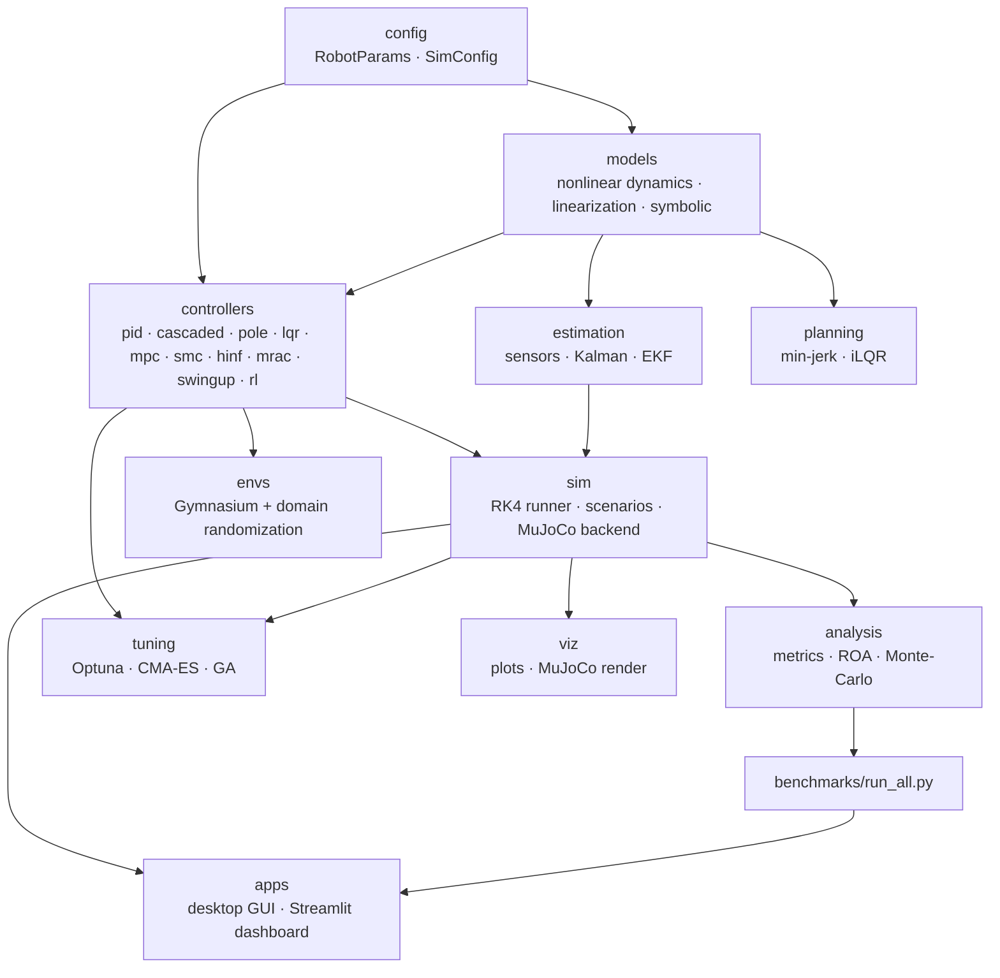

# Architecture

The design goal is **one shared engine** that every front-end, analysis tool, and optimizer
calls — so a controller is always designed for exactly the robot it is simulated on, and
results are consistent across the CLI, benchmark, GUI, and dashboard.

## Module map

## Key principles

1. **Single source of truth for physics.** `RobotParams` is consumed by the dynamics, every
   controller, the simulator, the estimator, and the analysis tools — eliminating the
   legacy bug where two inconsistent parameter sets coexisted.
2. **Uniform controller interface.** Every controller implements `compute(state, t)`; the
   runner handles reference tracking by passing `state − reference`. One `build_controller`
   factory backs the CLI, benchmark, tuners, and UIs.
3. **Headless-first.** The default RK4 backend needs no display, so tests and benchmarks run
   in CI; MuJoCo is a thin, optional high-fidelity layer that also cross-checks the model.
4. **Validated, not asserted.** The linearization is checked three independent ways; every
   controller has a test proving it stabilizes the *nonlinear* plant.

## The two backends

| | Analytic (default) | MuJoCo |
|---|---|---|
| Integrator | fixed-step RK4 | MuJoCo physics |
| Display | none (headless) | 3D render → GIF/MP4 |
| Use | tests, benchmark, tuning, RL | visualization, physics cross-check |
| Shares | controllers, metrics, scenarios | controllers, metrics, scenarios |
